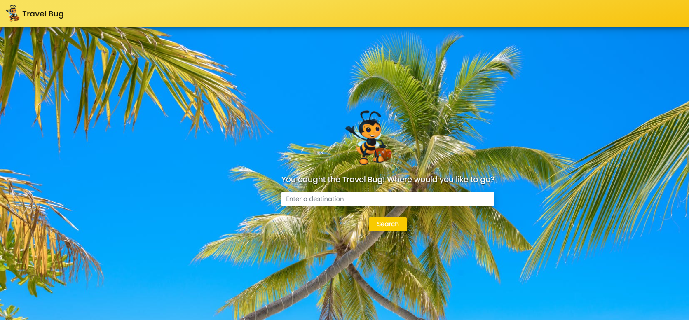
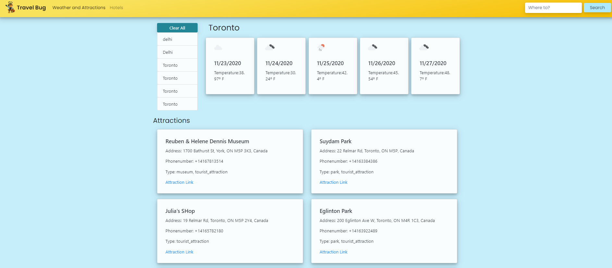
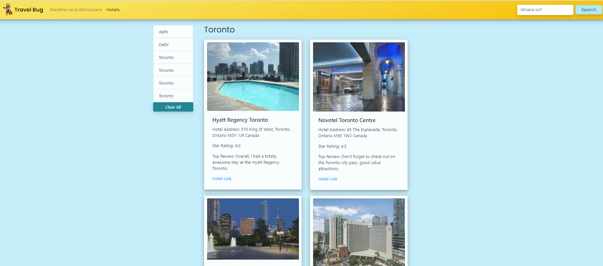

# TravelBug

## Description

TravelBug is a travel app that allows the user to search for the weather, attractions and hotels from a city of their choice.

## Table of Contents

* [Technologies](#technologies)
* [Installation](#installation)
* [Deployment](#deployment)
* [Credits](#credits)
* [License](#license)
* [Questions](#questions)

## Technologies

- CSS
- HTML
- JavaScript
- jQuery
- Bootstrap
- Moment

## Installation

Application uses 3 different API's to pull necessary information as listed below:

Trip Advisor - Hotels 

True Way - Attractions

Open Weather - Forecast


## Usage

* Home page allows the user to enter the desired travel destination.



* Once the destination is selected, the application displays weather forecast for next 5 consecutive days as well as displays the top attraction around the selected destination.



Final page displays the hotels around the area along with a google link to book the rooms.



## Deployment

Below is a link to the deployed application:


## Credits

- Anjali Pant
- Jessica Zonta
- Garman Kwan
- Farhin Chowdhury
- Kelsey Bathurst

## License 

```
Copyright 2020 <Anjali Pant>

Permission is hereby granted, free of charge, to any person obtaining a copy of this software and associated documentation files (the "Software"), to deal in the Software without restriction, including without limitation the rights to use, copy, modify, merge, publish, distribute, sublicense, and/or sell copies of the Software, and to permit persons to whom the Software is furnished to do so, subject to the following conditions:

The above copyright notice and this permission notice shall be included in all copies or substantial portions of the Software.

THE SOFTWARE IS PROVIDED "AS IS", WITHOUT WARRANTY OF ANY KIND, EXPRESS OR IMPLIED, INCLUDING BUT NOT LIMITED TO THE WARRANTIES OF MERCHANTABILITY, FITNESS FOR A PARTICULAR PURPOSE AND NONINFRINGEMENT. IN NO EVENT SHALL THE AUTHORS OR COPYRIGHT HOLDERS BE LIABLE FOR ANY CLAIM, DAMAGES OR OTHER LIABILITY, WHETHER IN AN ACTION OF CONTRACT, TORT OR OTHERWISE, ARISING FROM, OUT OF OR IN CONNECTION WITH THE SOFTWARE OR THE USE OR OTHER DEALINGS IN THE SOFTWARE.
```
## Questions

For more questions about this project, feel free to view the github repository

- [GitHub](https://github.com/Anjali9293/TravelBug)

